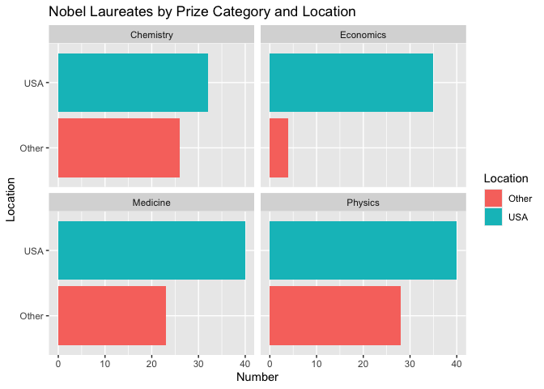

Lab 03 - Nobel laureates
================
Enhui Wang
2025.1.23

### Load packages and data

``` r
library(tidyverse) 
```

``` r
nobel <- read_csv("data/nobel.csv")
```

## Exercises

### Exercise 1

Nobel has 935 observations and 26 variables. Each row presents a Nobel
laureate, such as name, the year they won, biographical information,
etc.

``` r
nrow(nobel)#the number of rows (observations)
```

    ## [1] 935

``` r
ncol(nobel)#the number of columns (variables)
```

    ## [1] 26

### Exercise 2

``` r
nobel_living <- nobel %>%
  filter(!is.na(country),#laureates for whom country is available
  gender != "org", #exclude organizations
  is.na (died_date))# still live people

#check the number of observations
nrow(nobel_living)
```

    ## [1] 228

### Exercise 3

According to the plot, the Buzzfeed headline is supported by the data
because the US bars are significantly taller across all categories.

``` r
#identify whether the laureate was in the USA
nobel_living <- nobel_living %>%
  mutate(
    country_us = if_else(country == "USA", "USA", "Other")
  ) 

#limit the analysis to some categories
nobel_living_science <- nobel_living %>%
  filter(category %in% c("Physics", "Medicine", "Chemistry", "Economics"))
```

``` r
library(ggplot2)

#create the faceted bar plot
ggplot(nobel_living_science, aes(x = country_us, fill = country_us )) + 
  geom_bar() +
  facet_wrap (~ category) + #creates separate facets for each category
  coord_flip() + #flips the bars horizontally
  labs(
  title = "Nobel Laureates by Prize Category and Location",
  x = "Location",
  y = "Number",
  fill = "Location" )
```

<!-- -->

### Exercise 4

105 winners are born in the US.

``` r
#create a new variable called born_country_us
nobel_living_science <- nobel_living_science %>%
  mutate(
    born_country_us = if_else(born_country == "USA", "USA", "Other")
  ) 

#count the number of winners born in the US
us_born_number <- nobel_living_science %>%
  filter(born_country_us == "USA") %>%
  summarise(count = n())

us_born_number
```

    ## # A tibble: 1 × 1
    ##   count
    ##   <int>
    ## 1   105

### Exercise 5

It supports Buzzfeed’s claim because the “USA” bars are longer than
“Others” in most facets, excluding Chemistry.

``` r
library(ggplot2)

#create the faceted bar plot
ggplot(nobel_living_science, aes(x = country_us, fill = born_country_us )) + 
  geom_bar(position = "stack") +
  facet_wrap (~ category) + #creates separate facets for each category
  coord_flip() + #flips the bars horizontally
  labs(
  title = "Nobel Laureates by Prize Category, win_prize_place, and birthplace",
  x = "Location",
  y = "Number",
  fill = "Born in" )
```

<!-- -->

### Exercise 6

Germany and UK are the most common.

``` r
library (dplyr)

# Create the frequency table
born_outside_us <- nobel_living_science %>%
  filter(country_us == "USA", born_country_us == "Other") %>%  # filter for laureates who won in the US but were born outside the US
  count(born_country) %>% #create the frequency table
  arrange(desc (n))# arrange the data frame in descending order

born_outside_us
```

    ## # A tibble: 21 × 2
    ##    born_country       n
    ##    <chr>          <int>
    ##  1 Germany            7
    ##  2 United Kingdom     7
    ##  3 China              5
    ##  4 Canada             4
    ##  5 Japan              3
    ##  6 Australia          2
    ##  7 Israel             2
    ##  8 Norway             2
    ##  9 Austria            1
    ## 10 Finland            1
    ## # ℹ 11 more rows
